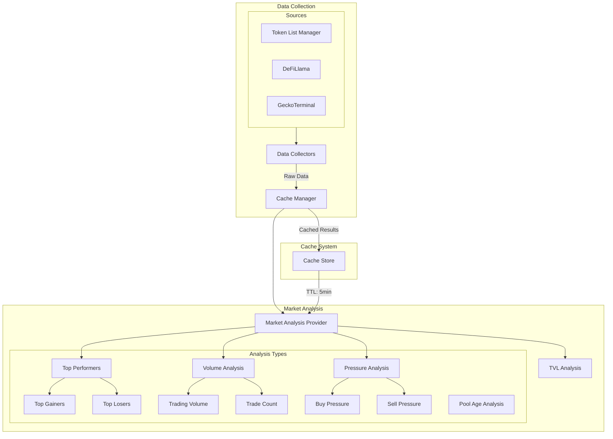
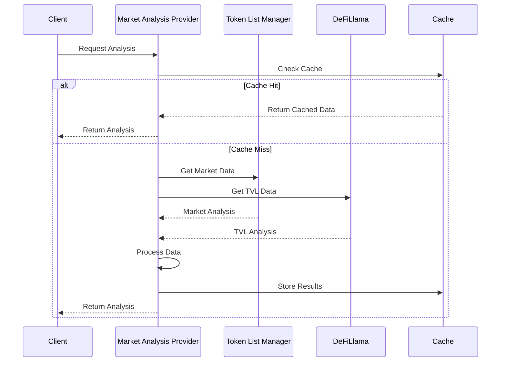

# Conflux Analysis System

This document outlines the analysis system architecture and implementation details for the Conflux Plugin.

## System Overview



## Component Architecture

### 1. Market Analysis Provider

```typescript
interface MarketAnalysisConfig {
    tokenListManager?: TokenListManager;
    cacheDuration?: number;
    chain?: string;
}

type AnalysisType =
    | 'gainers'    // Top price gainers
    | 'losers'     // Top price losers
    | 'volume'     // Highest trading volume
    | 'trades'     // Most trades
    | 'age'        // Pool age analysis
    | 'buyPressure'  // Highest buy pressure
    | 'sellPressure' // Highest sell pressure
    | 'full'        // Complete analysis
    | 'tvl'         // Total Value Locked analysis
```

## Implementation Details

### 1. Market Analysis Provider

```typescript
class MarketAnalysisProvider {
    private tokenListManager: TokenListManager;
    private cacheDuration: number = 300; // 5 minutes default
    private chain: string = 'conflux';

    async getAnalysisData(request: {
        type: AnalysisType;
        limit?: number
    }): Promise<string> {
        const limit = request.limit || 5;

        switch (request.type) {
            case 'tvl':
                return getTVLAnalysis(chain);
            case 'full':
                return getCombinedAnalysis();
            case 'gainers':
                return getTopGainers(limit);
            case 'losers':
                return getTopLosers(limit);
            case 'volume':
                return getTopVolume(limit);
            case 'trades':
                return getTopTrades(limit);
            case 'age':
                return getPoolsByAge(limit);
            case 'buyPressure':
                return getMostBuyPressure(limit);
            case 'sellPressure':
                return getMostSellPressure(limit);
        }
    }
}
```

### 2. Cache Management

```typescript
interface CacheConfig {
    key: string;           // Cache key format: market:analysis:{type}:{limit}
    duration: number;      // Default: 300 seconds (5 minutes)
    analysisType: string;
    limit: number;
}

class CacheManager {
    async get(key: string): Promise<string | null>;
    async set(key: string, data: string, options: { expires: number }): Promise<void>;
}
```

### 3. TVL Analysis

```typescript
interface TVLAnalysis {
    chain: string;
    current: number;
    change24h: number;
    change7d: number;
    protocols: {
        name: string;
        tvl: number;
        change24h: number;
    }[];
}

class DeFiLlama {
    async getChainTVL(chain: string): Promise<TVLData>;
    formatTVLToText(data: TVLData, chain: string): string;
}
```

## Data Flow



## Best Practices

1. **Cache Management**
   - Use 5-minute cache duration for market data
   - Implement cache invalidation on significant changes
   - Use hierarchical cache keys for different analysis types

2. **Analysis Types**
   - Provide focused analysis for specific metrics
   - Support combined analysis for comprehensive view
   - Include relevant instructions with analysis results

3. **Error Handling**
   - Graceful degradation when services are unavailable
   - Detailed error logging
   - Fallback to cached data when possible

4. **Performance**
   - Parallel data fetching where possible
   - Efficient cache utilization
   - Optimized data processing

## Future Improvements

1. **Enhanced Analytics**
   - Historical trend analysis
   - Price correlation analysis
   - Liquidity depth analysis
   - Volume profile analysis

2. **Additional Data Sources**
   - Cross-DEX analysis
   - Order book analysis
   - Social sentiment integration
   - On-chain metrics integration

3. **Analysis Features**
   - Custom timeframe analysis
   - Comparative analysis
   - Risk metrics
   - Market impact analysis

4. **Caching Improvements**
   - Progressive cache updates
   - Smart cache invalidation
   - Multi-level caching
   - Cache warming strategies