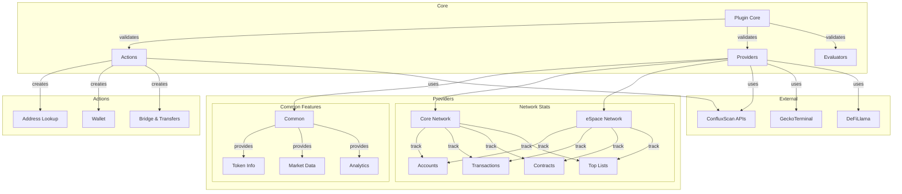
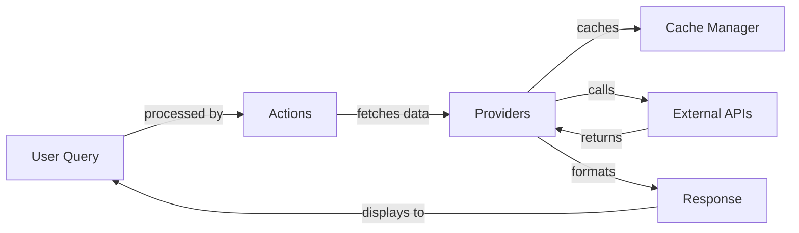

# Conflux Plugin Technical Documentation

## Table of Contents
1. [Environment Variables](#environment-variables)
2. [Architecture](#architecture)
3. [Function Listings](#function-listings)
4. [API Integrations](#api-integrations)

## Environment Variables

The Conflux plugin relies on several environment variables for configuration. The plugin's functionality is determined by the combination of these variables.


### Critical Variables
```env
# Required - Plugin will not activate without this
CONFLUX_TARGET=mainnet|testnet              # Network target for all operations
```

### Authentication Methods
```env
# Option 1: Mnemonic (enables both networks)
CONFLUX_MNEMONIC=<mnemonic>                 # Mnemonic phrase for key derivation

# Option 2: Individual Private Keys
CONFLUX_CORE_PRIVATE_KEY=<private-key>      # Private key for Core network
CONFLUX_ESPACE_PRIVATE_KEY=<private-key>    # Private key for eSpace network
```

### Network RPC URLs
```env
# Optional - Defaults to chain-specific RPC endpoints
CONFLUX_CORE_RPC_URL=<rpc-url>             # Custom RPC endpoint for Core network (defaults to cive chains)
CONFLUX_ESPACE_RPC_URL=<rpc-url>           # Custom RPC endpoint for eSpace network (defaults to viem chains)
```

### Default RPC Endpoints

#### Core Network (via `cive` chains)
- Mainnet: `https://main.confluxrpc.com`
- Testnet: `https://test.confluxrpc.com`

#### eSpace Network (via `viem` chains)
- Mainnet: `https://evm.confluxrpc.com`
- Testnet: `https://evmtestnet.confluxrpc.com`

### API Integration Variables
```env
# Optional - Falls back to rate-limited access
CONFLUX_CORE_CONFLUXSCAN_APIKEY=<api-key>   # API key for ConfluxScan Core
CONFLUX_ESPACE_CONFLUXSCAN_APIKEY=<api-key> # API key for ConfluxScan eSpace

# Optional - Custom API endpoints
CONFLUX_CORE_CONFLUXSCAN_HOST=<host>        # Custom ConfluxScan Core host
CONFLUX_ESPACE_CONFLUXSCAN_HOST=<host>      # Custom ConfluxScan eSpace host
```

### Feature Availability Matrix

| Configuration State | Available Features |
|--------------------|-------------------|
| No CONFLUX_TARGET | Plugin deactivated |
| CONFLUX_TARGET only | Read-only API access via ConfluxScan |
| + CONFLUX_MNEMONIC | All features on both networks using default chain RPCs |
| + CONFLUX_CORE_PRIVATE_KEY | Core network actions using cive default RPC |
| + CONFLUX_ESPACE_PRIVATE_KEY | eSpace network actions using viem default RPC |
| + Custom RPC URLs | Same features using custom RPC endpoints |

### Network-Specific Features

#### Core Network
- Transfer CFX/Tokens
- Bridge to eSpace
- Network statistics
- Account data

#### eSpace Network
- Transfer CFX/Tokens
- Token swaps
- Network statistics
- Account data

### Configuration Hierarchy

1. **Base Configuration**
   ```typescript
   if (!target || !["mainnet", "testnet"].includes(target)) {
       return null; // Plugin deactivates
   }
   ```

2. **Wallet Initialization**
   ```typescript
   // Priority: Private Key > Mnemonic
   if (privateKey) {
       initializeWithPrivateKey();
   } else if (mnemonic) {
       initializeWithDerivedKey();
   }
   ```

3. **Feature Activation**
   - ConfluxScan APIs initialize regardless of wallet availability
   - Token List Manager requires network target only
   - GeckoTerminal initializes for mainnet only
   - Transaction features require respective network wallet

### Configuration Notes

1. **Network Target**:
   - Required for any functionality
   - Must be either 'mainnet' or 'testnet'
   - Affects all components consistently

2. **Authentication Flexibility**:
   - Mnemonic activates both networks
   - Private keys can be used independently
   - Mix of mnemonic and private keys is supported

3. **API Access**:
   - ConfluxScan access available without wallets
   - API keys optional but recommended
   - Custom endpoints for special deployments

4. **Security Considerations**:
   - Never commit private keys or mnemonics
   - Use environment variables or secure secrets management
   - API keys should be properly secured

5. **Network Consistency**:
   - All components use the same network target
   - Cannot mix mainnet/testnet in the same instance
   - Bridge operations require Core wallet configuration

## Architecture

The Conflux plugin is structured into several key components:

### Components



### Data Flow



### Package Dependencies

```mermaid
---
config:
  theme: neo-dark
  layout: elk
---
graph LR
    subgraph Core Dependencies
        EP[@elizaos/plugin-conflux] --> EC[@elizaos/core]
        EP --> CIVE[@cive:0.8.1]
        EP --> SCURE1[@scure/bip32]
        EP --> SCURE2[@scure/bip39]
        EP --> VIEM[viem]
    end

    subgraph API Integrations
        EP --> CSC[@conflux-lib/openapi-sdk-core:1.0.0]
        EP --> CSE[@conflux-lib/openapi-sdk-evm:1.0.0]
    end

    subgraph Build Tools
        EP --> TSUP[tsup]
        EP --> TS[typescript]
        EP --> ZOD[zod]
    end
```

## Function Listings

### 1. Actions

#### Bridge Operations
```typescript
createBridgeAction(config: ValidatedConfig): Action
- Name: "BRIDGE_CFX"
- Description: Bridge CFX tokens from Core to eSpace network
- Location: src/actions/bridge/
- Key Functions:
  - executeBridgeOperation(): Handles the actual bridge transaction
  - validateBridgeParams(): Validates bridge parameters
- Parameters:
  - toAddress: eSpace destination address
  - amount: Amount of CFX to bridge
```

#### CFX Transfer
```typescript
createCfxTransferAction(config: ValidatedConfig): Action
- Name: "SEND_CFX"
- Description: Transfer CFX tokens on Core or eSpace network
- Location: src/actions/cfx-transfer/
- Features:
  - Auto-detects network from address format
  - Supports both Core and eSpace transfers
  - Gas estimation and optimization
- Parameters:
  - toAddress: Destination address (cfx:... or 0x...)
  - amount: Amount to transfer
```

#### Token Transfer
```typescript
createTokenTransferAction(config: ValidatedConfig): Action
- Name: "SEND_TOKEN"
- Description: Transfer tokens on Core or eSpace network
- Location: src/actions/token-transfer/
- Requirements:
  - Configured wallet (Core or eSpace)
  - ConfluxScan access for token validation
- Parameters:
  - tokenSymbol: Token symbol to transfer
  - toAddress: Destination address
  - amount: Amount to transfer
```

#### eSpace Swap
```typescript
createEspaceSwapAction(config: ValidatedConfig): Action
- Name: "SWAP_ESPACE"
- Description: Swap tokens on Conflux eSpace network
- Location: src/actions/espace-swap/
- Requirements:
  - eSpace wallet configuration
  - Token list manager for validation
  - Price data for slippage calculation
- Parameters:
  - fromToken: Source token symbol
  - toToken: Destination token symbol
  - amount: Amount to swap
```

#### ConfiPump Operations
```typescript
confiPump: Action
- Name: "CONFI_PUMP_ESPACE"
- Description: Perform actions on ConfiPump on Conflux eSpace network
- Location: src/actions/confipump/
- Features:
  - Create new tokens
  - Buy tokens
  - Sell tokens
- Operations:
  1. Create Token:
     - Parameters:
       - name: Token name
       - symbol: Token symbol
       - description: Token description
  2. Buy Token:
     - Parameters:
       - tokenAddress: Token contract address
       - value: Amount of CFX to spend
  3. Sell Token:
     - Parameters:
       - tokenAddress: Token contract address
       - amount: Amount of tokens to sell
```

#### Address Lookup
```typescript
createAddressLookupAction(config: ValidatedConfig): Action
- Name: "ADDRESS_LOOKUP"
- Description: Look up address information on Conflux network
- Location: src/actions/address-lookup/
- Features:
  - Address validation
  - Network detection
  - Balance checking
- Parameters:
  - address: Address to look up
```